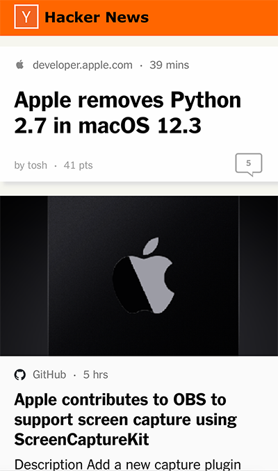

# Hacker News Alternative UI

This project contains an [alternative web UI](https://hughmandeville.github.io/hnui/) for [Hacker News](https://news.ycombinator.com/).

<https://hughmandeville.github.io/hnui/>

[](https://hughmandeville.github.io/hnui)

## Overview

The project consists of a React App to show the data and a Go script to get the data.

The Go script gets the top stories from the [Hacker News API](https://github.com/HackerNews/API) and adds some Open Graph fields (image, icon, title, and description). It calls the [GitHub API](https://docs.github.com/en/rest) to upload the data file ([hn_topstories.json](client/public/hn_topstories.json)) to GitHub.

## GitHub Pages

The React app is deployed to [GitHub Pages](https://hughmandeville.github.io/hnui/).

```sh
make get-hn-ts
```

## Running Locally

Use `make run-node` to start up the React app on [port 3000](http://localhost:3000/hnui).

```sh
make run-node
```

Use `make get-hn-ts` to run the Go program that gets the top stories data.

```sh
make get-hn-ts
```
